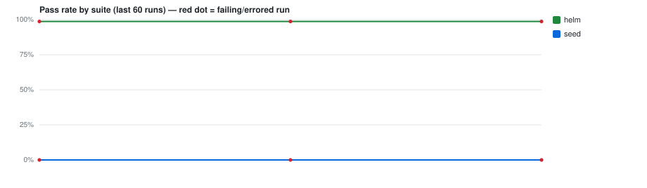

# CI test trends — `Ada-Edu/Ollie_MeetingNotes_Extraction`

> Auto-generated by **PR Validation** (`publish-test-history`). Do not edit by hand — every
> run regenerates this branch. The machine-readable source of truth is [`runs.jsonl`](./runs.jsonl).
> Deployed-environment E2E trends live separately on the [`e2e-history`](../../tree/e2e-history) branch.

**Last updated:** — · 6 records · suites: `helm`, `seed`



## Suites

| Suite | Latest | When (UTC) | Pass 24h | Pass 7d | Green streak | Runs |
|---|---|---|--:|--:|--:|--:|
| `helm` | ❌ `failed` [↗](https://github.com/Ada-Edu/Ollie_MeetingNotes_Extraction/actions/runs/32002914463) | — | — | — | 0 | 3 |
| `seed` | ❌ `failed` [↗](https://github.com/Ada-Edu/Ollie_MeetingNotes_Extraction/actions/runs/32002914463) | — | — | — | 0 | 3 |


## Recent runs

| When (UTC) | Suite | Result | Pass | Fail | Skip | Duration | Commit | Run |
|---|---|---|--:|--:|--:|--:|---|---|
| — | `seed` | ❌ failed | 0 | 1 | 0 | — | `2814ad3` | [#21](https://github.com/Ada-Edu/Ollie_MeetingNotes_Extraction/actions/runs/32002914463) |
| — | `helm` | ❌ failed | 151 | 2 | 0 | — | `2814ad3` | [#21](https://github.com/Ada-Edu/Ollie_MeetingNotes_Extraction/actions/runs/32002914463) |
| — | `seed` | ❌ failed | 0 | 1 | 0 | — | `585ee6b` | [#20](https://github.com/Ada-Edu/Ollie_MeetingNotes_Extraction/actions/runs/29718446048) |
| — | `helm` | ❌ failed | 151 | 2 | 0 | — | `585ee6b` | [#20](https://github.com/Ada-Edu/Ollie_MeetingNotes_Extraction/actions/runs/29718446048) |
| — | `seed` | ❌ failed | 0 | 1 | 0 | — | `1ebc78e` | [#1](https://github.com/Ada-Edu/Ollie_MeetingNotes_Extraction/actions/runs/28873172658) |
| — | `helm` | ❌ failed | 151 | 2 | 0 | — | `1ebc78e` | [#1](https://github.com/Ada-Edu/Ollie_MeetingNotes_Extraction/actions/runs/28873172658) |


## Unstable tests (recent window)

_No failing or flaky tests in the recent window. 🎉_


---

### Reading this data programmatically

```bash
# every line is one suite-run; newest last
git show ci-history:runs.jsonl | tail -n 20

# e.g. the unit suite's pass-rate over its last 50 runs
git show ci-history:runs.jsonl \
  | jq -rs '[.[] | select(.suite=="unit")] | .[-50:]
            | (map(select(.outcome=="passed")) | length) / length * 100'
```

Record shape: `{ ts, suite, outcome, pass_rate, stats:{expected,unexpected,flaky,skipped,total,duration_ms}, run_url, sha_short, branch, trigger, tests:[{title,file,status,duration_ms}] }`
